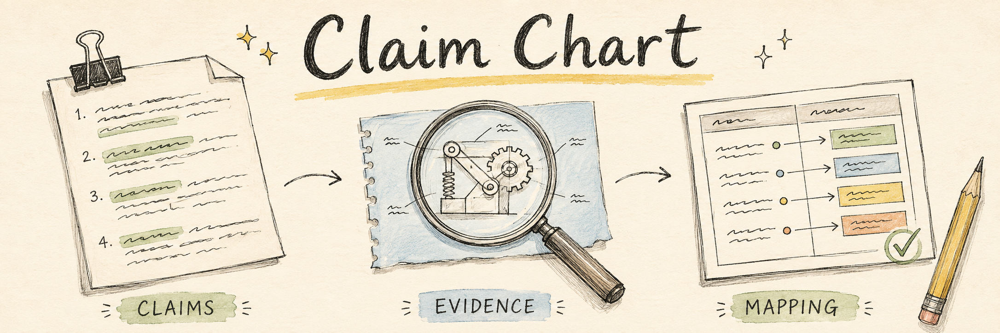

<a id="top"></a>

<p align="center">
  
</p>

<h1 align="center">Claim Chart</h1>

<p align="center">
  <strong>让每一项技术对应，都有据可查。</strong><br>
  一个用于研究、撰写和完善 Word 专利对照表的 Codex Skill。
</p>

<p align="center">
  
</p>

<p align="center">
  <a href="#quick-start"><strong>开始使用</strong></a> &nbsp;·&nbsp;
  <a href="SKILL.md">阅读 Skill</a> &nbsp;·&nbsp;
  <a href="https://github.com/yejingchen123/claim-chart/issues">反馈问题</a>
</p>

<p align="center">
  <a href="README.md">English</a> &nbsp; / &nbsp; <strong>简体中文</strong>
</p>

---

<p align="center">
  <a href="#overview">项目介绍</a> &nbsp; / &nbsp;
  <a href="#quick-start">快速开始</a> &nbsp; / &nbsp;
  <a href="#workflow">工作流程</a> &nbsp; / &nbsp;
  <a href="#docx-helper">文档检查</a> &nbsp; / &nbsp;
  <a href="#inside-the-repository">仓库结构</a>
</p>

<a id="overview"></a>

## 从技术研究，到文档细节

提供一份待完成的 claim chart、一份已经完成的参考文档，以及要对比的公司。这个 Skill 会引导 Codex 确定具体产品，将权利要求逐项对应到技术证据，再按照参考文档的样式完成公司侧内容，交付 `.docx`。

<table>
  <tr>
    <td width="50%" valign="top">
      <br>
      <strong>由你的模板决定样式</strong><br>
      保留专利原文、表格结构、字体、开头顺序和证据布局，遵循参考文档的实际约定。
    </td>
    <td width="50%" valign="top">
      <br>
      <strong>让证据可以追溯</strong><br>
      研究官方产品页面和技术资料，为相关内容截取真实来源画面，并配上对应 URL。
    </td>
  </tr>
  <tr>
    <td width="50%" valign="top">
      <br>
      <strong>写清技术对应的依据</strong><br>
      区分实际部署已确认的事实、合作方平台披露，以及仍缺乏确认的对应关系。
    </td>
    <td width="50%" valign="top">
      <br>
      <strong>检查到每一页</strong><br>
      用脚本检查常见 DOCX 问题，再逐页查看渲染结果，修正排版和证据可读性。
    </td>
  </tr>
</table>

> **参考文档就是样式标准。** 模板没有的开场说明、段内引用标签或证据配文，成品也不应擅自添加。

<a id="quick-start"></a>

## 准备三个输入，开始使用

| 需要提供 | 用途 |
| :--- | :--- |
| **待完成的 `.docx`** | 提供权利要求行，以及需要填写的公司列。 |
| **参考 `.docx`** | 用完成的示例明确写法、格式与证据位置。 |
| **对比公司** | 确定研究对象；如有指定产品、部署场景或时间范围，也一并说明。 |

### 1. 安装 Skill

在 Codex 中对内置安装工具说：

```text
请使用 $skill-installer 安装以下仓库中的 claim-chart skill：
https://github.com/yejingchen123/claim-chart
SKILL.md 位于仓库根目录。
```

<details>
<summary><strong>也可以手动安装</strong></summary>

在 macOS 或 Linux 上安装为个人 Skill：

```sh
mkdir -p ~/.agents/skills
git clone https://github.com/yejingchen123/claim-chart.git ~/.agents/skills/claim-chart
```

Codex 会从 `~/.agents/skills` 发现个人 Skill；如果新 Skill 没有出现，可以重启 Codex。安装目录和调用方式见 [OpenAI 官方指南](https://learn.chatgpt.com/docs/build-skills)。

</details>

### 2. 打开工作文件夹

将两份 Word 文件放入私有工作文件夹，并在 Codex 中打开。工作环境需要支持网页研究、来源截图、DOCX 编辑和文档渲染；使用环境中已有的文档工具即可。本仓库提供 claim-chart 工作指引和 Python 检查脚本。

### 3. 交代本次任务

把下面的文件名和示例公司替换成你的实际内容：

```text
请使用 $claim-chart，完成 target.docx 中针对 ExampleCo 的对比。
reference.docx 是格式和写作参考。

请用英文填写公司列，并使用官方来源作为证据。
保留专利原文和表格结构，严格匹配参考文档的开头、加粗方式、
引用风格，以及截图与 URL 的布局。
对于尚未确认的对应关系，请明确说明；逐页检查渲染结果后，
将完成的文档保存为 completed.docx。
```

**最终交付：** 完成的 Word claim chart。原件、来源截图、研究笔记和渲染检查文件保留在私有工作文件夹中。

<a id="workflow"></a>

## 一份对照表的完成过程

| 步骤 | 工作重点 | 形成的结果 |
| :---: | :--- | :--- |
| **01** | **读懂参考文档** | 记录结构、写作风格、加粗范围和证据呈现约定。 |
| **02** | **确定对比范围** | 明确实际产品或服务、提供方、部署情况及相关时间。 |
| **03** | **研究并逐项对应** | 撰写各行分析，将技术映射与可归属的证据连接起来。 |
| **04** | **完成 Word 排版** | 插入截图与 URL，最后整理开头 References 和嵌套摘要表。 |
| **05** | **检查并逐页复核** | 运行辅助脚本，查看每页渲染结果，修正排版或样式偏差。 |

### 对应关系如何表达

典型的对应句式如下，方括号内容为占位示例：

> Herein, “**[完整的权利要求短语]**” corresponds to **[有证据支持的产品功能]**.

两侧对应内容按模板要求强调。前面的分析解释功能联系，并在对应关系旁保留实质性限定。

<details>
<summary><strong>如何处理合作方的技术资料</strong></summary>

目标公司可能通过合作方技术提供服务。研究需要先确认这条联系，并保留技术提供方的归属。

| 证据能够支持什么 | 对应分析应如何表述 |
| :--- | :--- |
| 明确指出该功能用于所评估的服务或配置 | **实际部署已确认** |
| 披露供应商平台具备该功能，但未确认当前部署是否采用 | **平台层面已披露** |
| 功能联系仍依赖假设或缺失的实现细节 | **对应关系为推断或尚未确认** |

这些区分用于指导原有分析文字，不要求在最终文档中增加新表格。详见[研究与证据边界](references/research-evidence.md)。

</details>

<a id="docx-helper"></a>

## 为收尾工作准备的小工具

仓库中的 Python 脚本负责检查常见的结构和格式问题。**默认只读检查；执行修复必须另存文件。**

在 Skill 仓库目录中运行下列命令，并确保 Python 环境中装有 `python-docx`：

```sh
python -m pip install python-docx
```

**对照参考文档进行检查**

```sh
python scripts/polish_claim_chart_docx.py chart.docx --check --template reference.docx
```

**修复 `References:`、`[Comment:` 和末尾 `]` 标记的格式**

```sh
python scripts/polish_claim_chart_docx.py chart.docx --fix-labels --output polished.docx
```

<details>
<summary><strong>参数和适用版式</strong></summary>

| 参数 | 行为 |
| :--- | :--- |
| `--check` | 只读验证，不改变输入文件；也是默认行为。 |
| `--template reference.docx` | 按参考文档推断出的约定进行检查。 |
| `--fix-labels` | 只修复引用标题和 Comment 边界标记，保留其他文字格式。 |
| `--reorder-url-first` | 显式将已确认、统一的“URL／图片”序列转换成“图片／URL”。 |
| `--output polished.docx` | 将修复结果另存为新文件；不允许覆盖原输入。 |

检查器针对常见版式：两个外层表格、公司内容位于第二列、证据采用图片在前的顺序。混合或不明确的证据序列需要人工配对；不同的模板约定可能需要人工复核。

脚本不负责搜索资料、判断技术事实的对应关系，也不能代替 Word 文档的视觉检查。

</details>

<a id="inside-the-repository"></a>

## 仓库里的内容

```text
claim-chart/
├── SKILL.md                         完整的 Agent 工作流程
├── agents/openai.yaml               Skill 展示名称与调用信息
├── references/
│   ├── style-contract.md            写作、格式与证据布局
│   └── research-evidence.md         范围、技术归属与证据强度
├── scripts/
│   └── polish_claim_chart_docx.py   只读检查与显式修复
├── tests/
│   └── test_polish_claim_chart_docx.py
└── assets/readme/                   README 插画资源
```

<a id="contributing"></a>

## 一起把细节打磨好

欢迎通过 Issue 和 Pull Request 改进可复现的格式问题、证据规则和模板适配。反馈问题时，请说明期望行为，并尽量提供一个小型的**虚构示例**。

修改辅助脚本后，运行回归测试：

```sh
python -m unittest discover -s tests -v
```

客户文档、真实证据截图和 QA 产物不应提交到这个公开仓库。测试会自行生成虚构的 DOCX 数据。

---

<p align="center">
  由 <a href="https://github.com/yejingchen123">yejingchen123</a> 持续打磨。<br>
  页面结构参考 <a href="https://github.com/othneildrew/Best-README-Template">Best-README-Template</a>。<br>
  <sub>手绘封面为 AI 生成的概念插画。<a href="assets/readme/ARTWORK.md">插画说明</a>。</sub>
</p>

<p align="center"><a href="#top">↑ 回到顶部</a></p>
